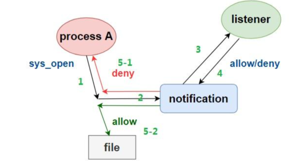

# 一、方式
1. stat
stat是一个在Linux系统上查看文件或文件系统状态的工具。用获取文件的最近访问时间、修改时间、权限等信息，并编写脚本以定期运行该命令以监控文件状态的变化。
2. sysdig 
  sysdig 是一个超级系统工具，可用来捕获系统状态信息。提供命令行接口以及强大的交互界面。支持各种 IO 活动：进程、文件、网络连接等。
3. inotifywait
需要安装inotify-tools。
4. inotify/fanotify
Linux 系统调用。

# 二、inotify简介
## 2.1 基本原理
inotify是Linux内核提供的一种文件系统监控机制。它通过在文件系统的目录上设置监视器来跟踪文件和目录的变化。当监视的文件或目录发生指定的事件时，内核会生成相应的事件通知。 从Linux内核2.6.13版本开始支持inotify。
## 2.2 主要特点
inotify具有以下主要特点：
- 支持多种事件类型：inotify支持多种事件类型，比如文件访问、修改、属性变化、打开、关闭等，应用程序可以根据需要选择监视的事件类型。
- 精确性：inotify可以精确地追踪指定目录或文件是移入，还是移出，关闭前是否写入等操作。
- 灵活性：应用程序可以根据具体需求动态添加和移除监视器，可以对不同的文件和目录设置不同的监视器。
- 高效性：inotify使用内核回调机制，避免了不必要的轮询操作。
这些特点使得inotify成为在Linux系统上实现文件系统监控的重要工具，广泛应用于文件同步、日志监控、自动化部署等领域。

## 2.3 工作方式
接口说明
```
#include <sys/inotify.h>

int inotify_init(void);
int inotify_init1(int flags);
/* 
 * flags：初始化标志，用于指定inotify实例的行为选项。
 * 可以使用以下标志进行设置：
 * IN_CLOEXEC：设置此标志后，在执行exec时会关闭inotify文件描述符。
 * IN_NONBLOCK：设置此标志后，inotify文件描述符将以非阻塞模式打开。
*/

int inotify_add_watch(int fd, const char *pathname, uint32_t mask);
/* fd： inotify实例的文件描述符。
 * pathname：监视的文件或目录的路径。
 * mask：监视的事件类型，可以是单个事件类型或多个事件类型的组合。
 */

struct inotify_event
{
  int wd;  //监控事件的文件描述符（watch descriptor）。
  uint32_t mask;  //表示事件的掩码，指定了哪些事件发生时会触发 inotify 通知。
  uint32_t cookie;  //用于关联相关的事件。
  uint32_t len;   //文件或目录名的长度。
  char name __flexarr;  //文件或目录的名称。__flexarr定义为[0]
};
```
调用流程：
1. 创建inotify实例：应用程序通过调用inotify_init()或inotify_init1()函数创建一个inotify实例，返回一个文件描述符。
2. 添加监视器：应用程序使用inotify_add_watch()函数将要监视的文件或目录添加到inotify实例中，并指定要监视的事件类型。
3. 读取事件：应用程序使用read()函数读取inotify实例的文件描述符，以获取事件通知。
4. 处理事件：应用程序读取到的事件通知，根据事件的类型执行相应的操作。

常用14事件：
  - IN_ACCESS：文件被访问（读取）。
  - IN_MODIFY：文件被修改。
  - IN_ATTRIB：文件属性发生变化，如权限、所有权或时间戳。
  - IN_CLOSE_WRITE：文件被关闭（写入完成）。
  - IN_CLOSE_NOWRITE：文件被关闭，但没有写入操作。
  - IN_OPEN：文件被打开。
  - IN_MOVED_FROM：文件被移出监控目录。
  - IN_MOVED_TO：文件被移入监控目录。
  - IN_CREATE：文件或目录被创建。
  - IN_DELETE：文件或目录被删除。
  - IN_DELETE_SELF：监控的文件或目录本身被删除。
  - IN_MOVE_SELF：监控的文件或目录本身被移动。
  - IN_UNMOUNT：文件系统被卸载。
  - IN_ONESHOT：只会触发一次事件通知
    1. 事件标志是用于指定一个 inotify 监听只会触发一次事件通知。这对于某些场景很有用，一旦触发了一次事件通知，不再需要继续监听的情况下，可以节省资源并简化代码逻辑。
    2. 需要注意的是，IN_ONESHOT 事件标志仅适用于单个事件。即使注册时设置了 IN_ONESHOT 标志，如果同一个文件或目录上发生多个事件，每个事件都会触发一个事件通知。只有当前注册的事件完成后，才会取消监听该。
    3. 此外，需要注意不同版本的 Linux 内核对 IN_ONESHOT 的支持可能会有所差异，请确保在目标系统上的内核版本中支持该标志。

实例演示：
统计写falsh次数，防止高频度写falsh引发坏块。
```
#include <stdio.h>
#include <stdlib.h>
#include <unistd.h>
#include <sys/inotify.h>

#define MAX_EVENTS 1024
#define EVENT_SIZE  (sizeof(struct inotify_event))
#define BUFFER_SIZE (MAX_EVENTS * (sizeof(struct inotify_event) + 16))

int main(int argc ,char* argv[]) {
    int fd, wd;
    struct inotify_event *event;
    char buffer[BUFFER_SIZE];
    ssize_t len;
    char * path = argv[1];
    long long num = 0;

    // 创建inotify实例
    fd = inotify_init();
    if (fd == -1) {
        perror("inotify_init");
        exit(EXIT_FAILURE);
    }

    // 添加监控的文件路径，并指定要监控的事件
    wd = inotify_add_watch(fd, path, IN_MODIFY | IN_OPEN);
    if (wd == -1) {
        perror("inotify_add_watch");
        exit(EXIT_FAILURE);
    }

    // 读取inotify事件
    while (1) {
        len = read(fd, buffer, BUFFER_SIZE);
        if (len == -1) {
            perror("read");
            exit(EXIT_FAILURE);
        }

        // 解析inotify事件
        event = (struct inotify_event *) buffer;
        while (len > 0) {
            if (event->mask & IN_MODIFY) {
                printf("File modified: %s num:%lld\n", event->name, num);
                num++;
            }
            if (event->mask & IN_OPEN) {
                printf("File opened: %s\n", event->name);
            }
            
            // 指向下一个事件
            event = (struct inotify_event *) ((char *) event + EVENT_SIZE + event->len);
            len -= EVENT_SIZE + event->len;
        }
    }

    // 关闭inotify实例
    close(fd);
    return 0;
}
```
以上实现了监控打开、修改两种种事件监控，当触发对应事件，会打印输出被操作的目录或文件名称，同时会输出修改文件次数。

## 2.4 开源项目中的应用
- 文件自动同步的功能：使用inotify来监控文件的变化，通过rsync同步。
  - inotify-tools：一组命令行工具，包括inotifywait和inotifywatch，用于监控文件系统事件。
  - inoticoming：是一个基于 inotify 机制的工具，用于在 Linux 系统上监视文件系统事件并执行相应的命令。
- Systemd：Linux系统初始化和管理守护进程，使用inotify来监控系统日志文件的变化。
- Android系统WiFi管理器：通过inotify监控wpa_supplicant.conf文件变化，读取新的配置信息。

### 2.5 注意事项
1. 文件描述符限制：Linux 系统对打开的文件描述符数量有限制，因此在监控大量文件或目录时，可能会超出文件描述符限制。可以使用 ulimit  命令或调整系统配置文件来增加文件描述符数量限制。
文件描述符限制对于使用 inotify 监控文件系统特别重要。当使用 inotify 监控大量的文件或目录时，每个监控项都需要占用一个文件描述符。如果超过了进程的文件描述符限制，就无法继续创建新的监控项。
2. 内核限制：Linux 内核也对 inotify 实例数量和队列大小有限制。可以通过修改 /proc/sys/fs/inotify 目录下的文件来调整这些限制。
max_user_instances 表示每个用户可创建的 inotify 实例数量的最大限制。每个实例可以监视多个文件或目录。一般默认是128。
max_user_watches 表示每个用户可创建的监控项（watch）的最大数量。监控项是 inotify 实例中用于监控文件或目录的对象。一般默认是 8192。
 max_queued_events 表示每个 inotify 实例的事件队列的最大容量。事件队列用于存储待处理的事件通知。一般默认是16384。
3. 监控路径的长度限制： 对于每个inotify实例，路径长度限制为通常是4096个字节。如果路径超过这个限制，inotify_add_watch函数会返回ENAMETOOLONG错误。
4. 文件系统限制：大部分Linux文件系统都支持inotify。但网络文件系统（如 NFS）一般不支持 inotify。在使用 inotify 时，确保文件系统支持和兼容性。
5. 事件溢出：如果事件队列满了，新的事件将被丢弃，这可能导致丢失重要的事件。可以通过适当调整事件队列的大小或及时处理事件来避免事件溢出。
6. 性能开销：inotify 监控是实时的，对于大量文件或目录的监控可能带来较大的性能开销。可以通过使用批量处理、事件队列、并发处理等技术来优化性能，减少系统调用次数。
7. 注意事件顺序：inotify 提供的事件顺序是不可靠的，即不能保证事件的顺序。在处理事件时，要谨慎处理，并避免对事件顺序有依赖的操作。

### 2.6 常见问题
1. 实现监控子目录
除了监控单个文件，inotify还可以监控整个目录，但只能监控一级目录，二级及以下子目录是不支持的，需要通过inotify_add_watch添加子目录。建议单独启动线程遍历整个目录逐一添加，监控到创建子目录事件时，再添加到监控。
2. 批量处理事件
当有大量事件到达时，处理每个事件可能会带来性能问题。可以考虑以下方式解决。
- 事件缓冲区： 创建一个事件缓冲区，用于存储inotify事件。当有新的事件到达时，将其添加到缓冲区中，而不立即处理事件。这样可以避免在处理一个事件时，另一个事件到达导致的中断。
- 事件合并： 如果多个事件发生在同一个文件上，并且这些事件之间的时间间隔很短，你可以考虑将它们合并为一个事件进行处理。例如，如果一个文件在短时间内连续被修改了多次，你可以只触发一次处理操作，而不是每次修改都触发。
- 并发处理： 使用多线程或多进程来并发处理事件。将事件分发给多个处理线程或进程，可以并行处理多个事件，提高处理速度。但要注意避免并发处理导致的竞态条件和资源冲突问题。
3. 无法追踪操作的进程。
  - 结合进程监控工具：如 lsof、fuser 或 ltrace 
局限：嵌入式设备系统上没有lsof、strace等命令。

# 三、fanotify简介
特性与优势
- 追踪操作文件的进程
- 支持操作阻断
- 支持整个目录监控，inotify仅支持一级目录监控，其子目录不在监控范围。
使用场景
- 文件安全监控与防篡改
- 行为分析与审计
- 实时反病毒扫描
- 文件同步和备份

接口介绍
```
#include <fcntl.h>
#include <sys/fanotify.h>

int fanotify_init(unsigned int flags, unsigned int event_f_flags);
/*
flags: 通知类别
  FAN_CLASS_NOTIF 默认值。不需要指定。该值仅允许接收通知的事件。
  FAN_CLASS_CONTENT 监控文件或者目录状态变化，给出阻止/放行的决定
  FAN_NONBLOCK 以非阻塞模式打开
  FAN_CLOEXEC 在执行exec时会关闭fanotify文件描述符
event_f_flags：文件状态标志，比如O_RDONLY O_RDONLY  O_LARGEFILE
*/
int fanotify_mark(int fanotify_fd, unsigned int flags, uint64_t mask, 
                int dirfd, const char*pathname);
/*
fanotify_fd：fanotify 文件描述符，通过 fanotify_init 函数获得。
flags：标记选项，可以使用 FAN_MARK_ADD 或 FAN_MARK_REMOVE 进行添加或移除标记。
mask：要监控的事件掩码，指定的事件类型。例如，FAN_OPEN | FAN_CLOSE_WRITE 表示你希望监控打开和写入关闭的事件。
dirfd：目标文件或目录所在的文件描述符。
pathname：目标文件或目录的路径。
*/

struct fanotify_event_metadata {
    __u32 event_len; //事件的长度，包括元数据结构体在内的整个事件的字节数。
    __u8 vers; // fanotify 版本号。
    __u8 reserved;
    __u16 metadata_len; //元数据结构体的长度。
    __aligned_u64 mask; //表示事件的掩码，指定了哪些事件发生时会触发 fanotify 通知。
    __s32 fd; //与事件相关的文件描述符。
    __s32 pid;//产生事件的进程的 PID。
};

struct fanotify_response {
    __s32 fd;
    __u32 response;
};

/* Legit userspace responses to a _PERM event */
#define FAN_ALLOW   0x01
#define FAN_DENY    0x02
#define FAN_AUDIT   0x10    /* Bit mask to create audit record for result */

FAN_EVENT_OK(meta, len)
FAN_EVENT_NEXT(meta, len)
常见事件
- FAN_ACCESS：文件被访问时触发事件。
- FAN_MODIFY：文件被修改时触发事件。
- FAN_CLOSE_WRITE：文件被写入并关闭时触发事件。
- FAN_CLOSE_NOWRITE：文件被关闭而没有写入时触发事件。
- FAN_OPEN：文件被打开时触发事件。
- FAN_OPEN_PERM：文件被打开且检查了权限时触发事件。
- FAN_ATTRIB：文件属性发生变化时触发事件。
- FAN_CREATE：文件或目录被创建时触发事件。
- FAN_DELETE：文件或目录被删除时触发事件。
- FAN_DELETE_SELF：监控的文件或目录本身被删除时触发事件。
- FAN_MOVE：文件或目录被移动时触发事件。
- FAN_MOVE_SELF：监控的文件或目录本身被移动时触发事件。
- FAN_CLOSE：文件被关闭时触发事件（包括写入和未写入的情况）。
- FAN_ALL_EVENTS：所有事件的组合，用于方便地监控所有事件。
```

fanotify实例演示
示例1
根据监控事件，获取对应修改文件的程序名称及被修改文件名称
```
#define _GNU_SOURCE

#include <stdio.h>
#include <signal.h>
#include <string.h>
#include <unistd.h>
#include <stdlib.h>
#include <poll.h>
#include <errno.h>
#include <limits.h>
#include <sys/stat.h>
#include <sys/signalfd.h>
#include <fcntl.h>

#include <linux/fanotify.h>

/* Structure to keep track of monitored directories */
typedef struct {
  /* Path of the directory */
  char *path;
} monitored_t;

/* Size of buffer to use when reading fanotify events */
#define FANOTIFY_BUFFER_SIZE 8192

/* Enumerate list of FDs to poll */
enum {
  FD_POLL_SIGNAL = 0,
  FD_POLL_FANOTIFY,
  FD_POLL_MAX
};

/* Setup fanotify notifications (FAN) mask. All these defined in fanotify.h. */
static uint64_t event_mask =
  (FAN_ACCESS |         
   FAN_MODIFY |         
   FAN_CLOSE_WRITE |   
   FAN_CLOSE_NOWRITE | 
   FAN_OPEN );
/* Array of directories being monitored */
static monitored_t *monitors;
static int n_monitors;

static char * get_program_name_from_pid (int     pid,char   *buffer,size_t  buffer_size)
{
    int fd;
    ssize_t len;
    char *aux;

    /* Try to get program name by PID */
    sprintf (buffer, "/proc/%d/cmdline", pid);
    if ((fd = open (buffer, O_RDONLY)) < 0)
        return NULL;

    /* Read file contents into buffer */
    if ((len = read (fd, buffer, buffer_size - 1)) <= 0)
    {
        close (fd);
        return NULL;
    }
    close (fd);

    buffer[len] = '\0';
    aux = strstr (buffer, "^@");
    if (aux)
        *aux = '\0';

    return buffer;
}

static char * get_file_path_from_fd (int     fd, char   *buffer, size_t  buffer_size)
{
    ssize_t len;

    if (fd <= 0)
        return NULL;

    sprintf (buffer, "/proc/self/fd/%d", fd);
    if ((len = readlink (buffer, buffer, buffer_size - 1)) < 0)
        return NULL;

    buffer[len] = '\0';
    return buffer;
}

static void event_process (struct fanotify_event_metadata *event)
{
    char path[PATH_MAX];

    printf ("Received event in path '%s'",
            get_file_path_from_fd (event->fd,path,PATH_MAX) ? path : "unknown");
    printf (" pid=%d (%s): \n",event->pid,(get_program_name_from_pid (event->pid,path,
            PATH_MAX) ? path : "unknown"));

    if (event->mask & FAN_OPEN)
        printf ("\tFAN_OPEN\n");
    if (event->mask & FAN_ACCESS)
        printf ("\tFAN_ACCESS\n");
    if (event->mask & FAN_MODIFY)
        printf ("\tFAN_MODIFY\n");
    if (event->mask & FAN_CLOSE_WRITE)
        printf ("\tFAN_CLOSE_WRITE\n");
    if (event->mask & FAN_CLOSE_NOWRITE)
        printf ("\tFAN_CLOSE_NOWRITE\n");
    fflush (stdout);

    close (event->fd);
}

static void shutdown_fanotify (int fanotify_fd)
{
    int i;

    for (i = 0; i < n_monitors; ++i)
    {
        /* Remove the mark, using same event mask as when creating it */
        fanotify_mark (fanotify_fd,FAN_MARK_REMOVE,event_mask,AT_FDCWD,
                        monitors[i].path);
        free (monitors[i].path);
    }
    free (monitors);
    close (fanotify_fd);
}

static int initialize_fanotify (int argc, const char **argv)
{
    int i;
    int fanotify_fd;

    /*
    FAN_CLASS_NOTIF: 默认值，可以不配置
    FAN_CLOEXEC: 表示在执行 exec 类系统调用时关闭 fanotify 文件描述符。使用这个标志位可以确保在子进程中不会继承 fanotify 的文件描述符。
    O_RDONLY : 表示以只读模式打开文件
    O_CLOEXEC : 表示在执行 exec 类系统调用时关闭文件描述符。
    */
    if ((fanotify_fd = fanotify_init (FAN_CLASS_NOTIF|FAN_CLOEXEC,O_RDONLY | O_CLOEXEC
                                     | O_LARGEFILE)) < 0)
    {
      fprintf (stderr,
               "Couldn't setup new fanotify device: %s\n",
               strerror (errno));
      return -1;
    }

    /* Allocate array of monitor setups */
    n_monitors = argc - 1;
    monitors = malloc (n_monitors * sizeof (monitored_t));

    /* Loop all input directories, setting up marks */
    for (i = 0; i < n_monitors; ++i)
    {
        monitors[i].path = strdup (argv[i + 1]);
        /* Add new fanotify mark */
        if (fanotify_mark (fanotify_fd,FAN_MARK_ADD,event_mask,AT_FDCWD,
                    monitors[i].path) < 0)
        {
          fprintf (stderr,"Couldn't add monitor in directory '%s': '%s'\n",
                   monitors[i].path,strerror (errno));
            return -1;
        }

        printf ("Started monitoring directory '%s'...\n", monitors[i].path);
    }

    return fanotify_fd;
}

static void shutdown_signals (int signal_fd)
{
    close (signal_fd);
}

static int initialize_signals (void)
{
    int signal_fd;
    sigset_t sigmask;

    /* We want to handle SIGINT and SIGTERM in the signal_fd, so we block them. */
    sigemptyset (&sigmask);
    sigaddset (&sigmask, SIGINT);
    sigaddset (&sigmask, SIGTERM);

    if (sigprocmask (SIG_BLOCK, &sigmask, NULL) < 0)
    {
        fprintf (stderr,"Couldn't block signals: '%s'\n",strerror (errno));
        return -1;
    }

  /* Get new FD to read signals from it */
  if ((signal_fd = signalfd (-1, &sigmask, 0)) < 0)
    {
      fprintf (stderr,"Couldn't setup signal FD: '%s'\n",strerror (errno));
      return -1;
    }

    return signal_fd;
}

int main (int argc, const char **argv)
{
    int signal_fd;
    int fanotify_fd;
    struct pollfd fds[FD_POLL_MAX];

    /* Input arguments... */
    if (argc < 2)
    {
        fprintf (stderr, "Usage: %s directory1 [directory2 ...]\n", argv[0]);
        exit (EXIT_FAILURE);
    }

    /* Initialize signals FD */
    if ((signal_fd = initialize_signals ()) < 0)
    {
        fprintf (stderr, "Couldn't initialize signals\n");
        exit (EXIT_FAILURE);
    }

    /* Initialize fanotify FD and the marks */
    if ((fanotify_fd = initialize_fanotify (argc, argv)) < 0)
    {
        fprintf (stderr, "Couldn't initialize fanotify\n");
        exit (EXIT_FAILURE);
    }

    /* Setup polling */
    fds[FD_POLL_SIGNAL].fd = signal_fd;
    fds[FD_POLL_SIGNAL].events = POLLIN;
    fds[FD_POLL_FANOTIFY].fd = fanotify_fd;
    fds[FD_POLL_FANOTIFY].events = POLLIN;

    for (;;)
    {
        /* Block until there is something to be read */
        if (poll (fds, FD_POLL_MAX, -1) < 0)
        {
            fprintf (stderr,"Couldn't poll(): '%s'\n",strerror (errno));
            exit (EXIT_FAILURE);
        }

        /* Signal received? */
        if (fds[FD_POLL_SIGNAL].revents & POLLIN)
        {
            struct signalfd_siginfo fdsi;
            if (read (fds[FD_POLL_SIGNAL].fd,&fdsi, sizeof (fdsi)) != sizeof (fdsi))
            {
                fprintf (stderr,"Couldn't read signal, wrong size read\n");
                exit (EXIT_FAILURE);
            }

            /* Break loop if we got the expected signal */
            if (fdsi.ssi_signo == SIGINT || fdsi.ssi_signo == SIGTERM)
                break;

            fprintf (stderr,"Received unexpected signal\n");
        }

        if (fds[FD_POLL_FANOTIFY].revents & POLLIN)
        {
            char buffer[FANOTIFY_BUFFER_SIZE];
            ssize_t length;

            /* Read from the FD. It will read all events available up to
            * the given buffer size. */
            if ((length = read (fds[FD_POLL_FANOTIFY].fd,buffer,FANOTIFY_BUFFER_SIZE)) > 0)
            {
                struct fanotify_event_metadata *metadata;

                metadata = (struct fanotify_event_metadata *)buffer;
                while (FAN_EVENT_OK (metadata, length))
                {
                    event_process (metadata);
                    if (metadata->fd > 0)
                    close (metadata->fd);
                    metadata = FAN_EVENT_NEXT (metadata, length);
                }
            }
        }
    }

  /* Clean exit */
  shutdown_fanotify (fanotify_fd);
  shutdown_signals (signal_fd);

  printf ("Exiting fanotify example...\n");

  return EXIT_SUCCESS;
}
```

示例2
拦截访问

```
#include <stdio.h>
#include <stdlib.h>
#include <fcntl.h>
#include <unistd.h>
#include <sys/fanotify.h>

#define MAX_EVENTS 10
#define EVENT_SIZE (sizeof(struct fanotify_event_metadata) + 100)
#define BUFFER_SIZE (MAX_EVENTS * EVENT_SIZE)

int main(int argc, const char **argv) {
    char *path = (char *)argv[1];

    int fanotify_fd = fanotify_init(FAN_CLASS_CONTENT | FAN_CLOEXEC , O_RDONLY );

    if (fanotify_fd == -1) {
        perror("fanotify_init");
        exit(EXIT_FAILURE); 
    }

    int wd = fanotify_mark(fanotify_fd, FAN_MARK_ADD, FAN_OPEN_PERM, AT_FDCWD, path);

    if (wd == -1) {
        perror("fanotify_mark");
        exit(EXIT_FAILURE);
    }

    char buffer[BUFFER_SIZE];
    ssize_t len;
    struct fanotify_event_metadata *metadata;

    while (1) {
        len = read(fanotify_fd, buffer, sizeof(buffer));
        if (len == -1) {
            perror("read");
            exit(EXIT_FAILURE);
        }

        metadata = (struct fanotify_event_metadata *)buffer;

        while (FAN_EVENT_OK(metadata, len)) {
            if (metadata->mask & FAN_OPEN_PERM) {
                printf("FAN_OPEN_PERM\n");
                struct fanotify_response response;
                response.fd = metadata->fd;
                response.response = FAN_DENY; //FAN_ALLOW

                // 发送阻拦响应
                if (write(fanotify_fd, &response, sizeof(response)) != sizeof(response)) {
                    perror("write");
                    exit(EXIT_FAILURE);
                }
            }
            fflush (stdout);

            close (metadata->fd);

            // 进一步处理其他事件...

            metadata = FAN_EVENT_NEXT(metadata, len);
        }
    }

    return 0;
}
```

拦截流程：


注意事项
- 特权要求：fanotify需要root权限，请确保你有足够的权限来进行文件系统监控。
- 监控范围：fanotify 可以用于监控整个文件系统，若文件数量太过庞大，面临性能瓶颈和资源限制。
- 兼容性：fanotify 是 Linux 特定的机制，在其他操作系统或平台上可能不可用或工作方式不同。确保你的应用程序的目标环境支持 fanotify。
